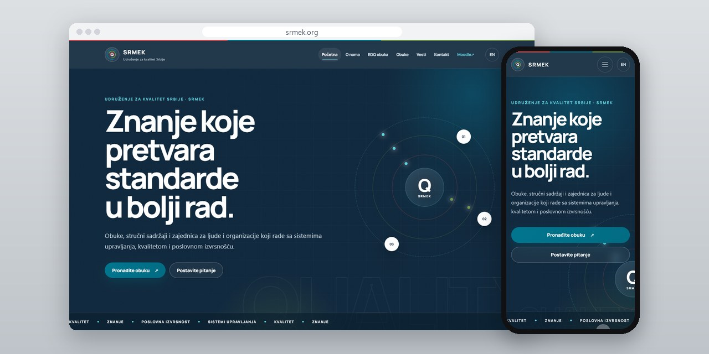
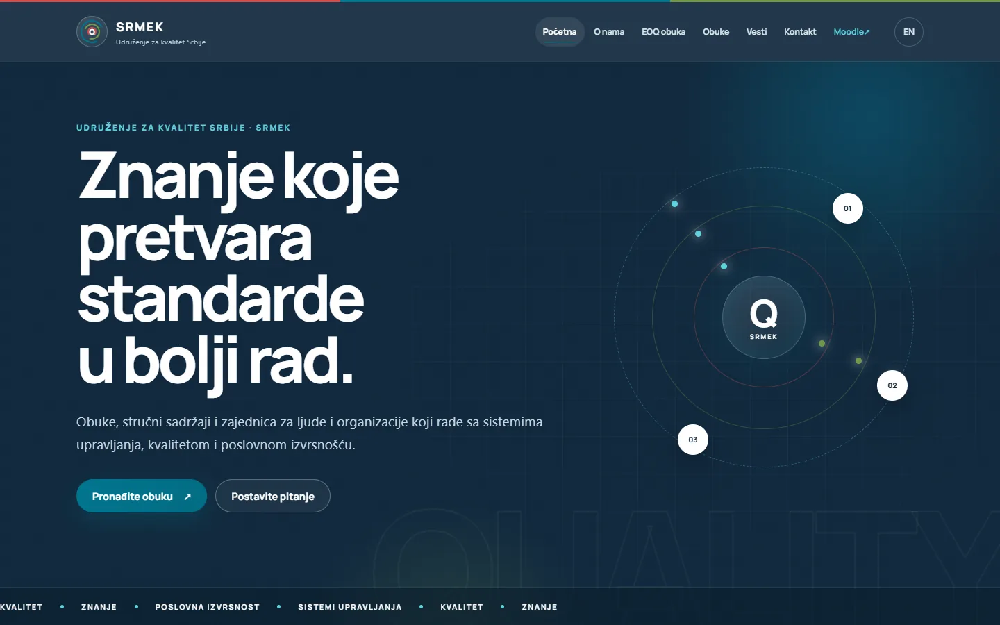
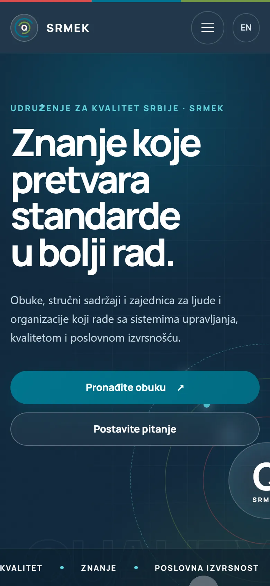
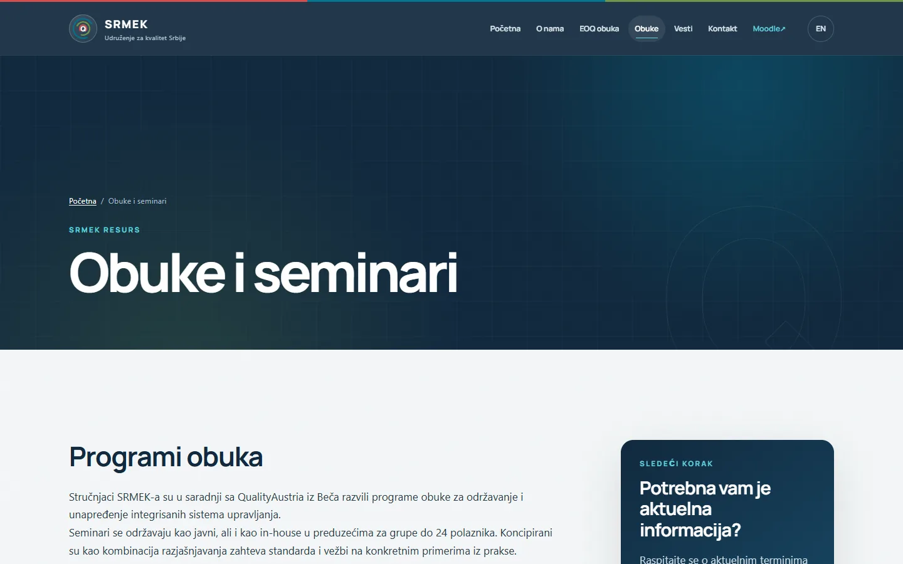
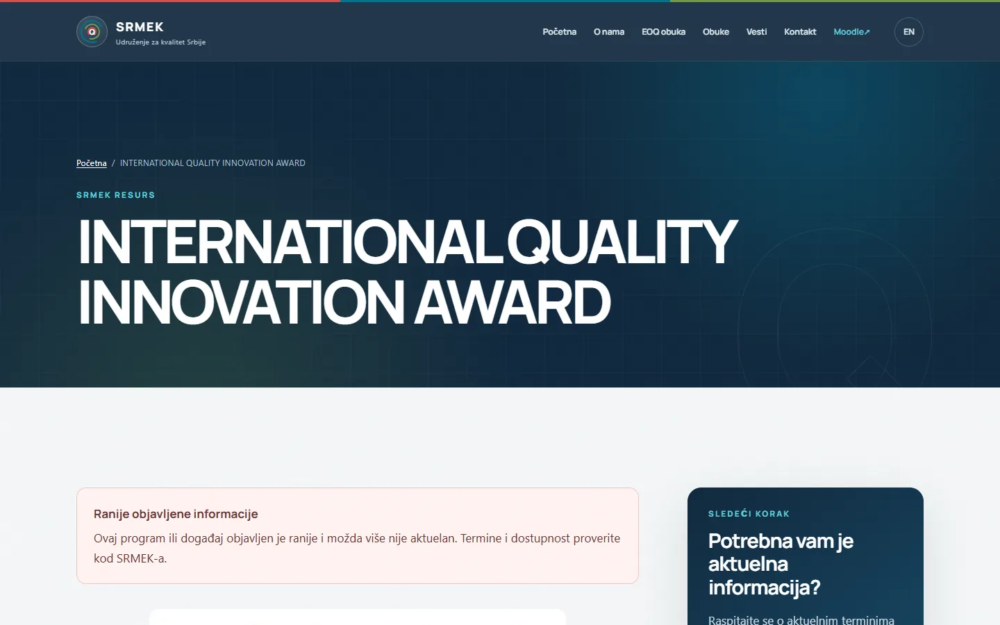

# SRMEK

Novi javni sajt Udruženja za kvalitet Srbije: strane renderuje PHP na serveru, a stari Drupal ostaje u pozadini.

**[srmek.org](https://srmek.org/)** · [English](README.md)

> [!NOTE]
> Klijentski projekat. Izvorni kod pripada klijentu i čuva se u privatnom repozitorijumu. Ova stranica opisuje šta sam uradio i kako.

<table>
  <tr><td><b>Klijent</b></td><td>SRMEK</td></tr>
  <tr><td><b>Delatnost</b></td><td>Udruženje za kvalitet: obuke i stručni sadržaji o sistemima upravljanja</td></tr>
  <tr><td><b>Lokacija</b></td><td>Kragujevac</td></tr>
  <tr><td><b>Vrsta</b></td><td>Dvojezični sajt sa više strana</td></tr>
  <tr><td><b>Moj deo posla</b></td><td>Redizajn, izrada, selidba, hosting i održavanje</td></tr>
  <tr><td><b>Tehnologije</b></td><td>PHP 8.3, Drupal (back office), Moodle, nginx</td></tr>
</table>

## O projektu

SRMEK je Udruženje za kvalitet Srbije sa sedištem u Kragujevcu. Okuplja menadžere kvaliteta, auditore, ustanove i firme, a drži i seminare iz ISO 9001, IATF 16949, ISO 14001, ISO 45001 i HACCP-a. Organizovalo je međunarodni kongres kvaliteta i nagradu za kvalitet inovacije. Javni sajt sam napravio iznova, na srpskom i engleskom, i preneo arhivu vesti, dokumenta i strane programa.

Nisam sve selio odjednom. Javne strane (oko 94 adrese u mapi sajta) renderuje PHP 8.3 na serveru. Stari Drupal u pozadini i dalje obrađuje forme i fajlove, a Moodle za e-učenje i sistemi za kongres ostaju povezani. Za stari sadržaj se odmah vidi da je star: programi i događaji objavljeni pre više godina nose napomenu da se termini provere kod udruženja, a uz brojke na naslovnoj piše da potiču sa prethodne verzije sajta i da nemaju datum ažuriranja.

## Šta sam uradio

- Javni deo koji PHP 8.3 renderuje na serveru, oko 94 adrese u mapi sajta, na srpskom i engleskom
- Stari Drupal ostao je u pozadini za forme i fajlove
- Moodle za e-učenje i sistemi za kongres povezani sa novim sajtom
- Katalog obuka po oblastima, sa oznakom seminara i trajanjem u danima
- Napomene na zastarelim stranama programa i događaja, i brojke sa starog sajta jasno označene kao takve
- Strog CSP sa nonce vrednošću za svaki zahtev, fontovi sa sopstvenog domena i dugme koje pauzira animacije

## Merenja

| | Performanse | Pristupačnost | Dobre prakse | SEO |
| :-- | :-: | :-: | :-: | :-: |
| Telefon | 100 | 100 | 96 | 100 |
| Desktop | 100 | 100 | 96 | 100 |

Lighthouse, laboratorijsko merenje živog sajta, septembar 2026.

## Snimci ekrana

<table>
  <tr>
    <td width="68%" valign="top"></td>
    <td width="32%" valign="top"></td>
  </tr>
</table>

Obuke i seminari

Nagrada za kvalitet i inovacije

---

Izrada: [D. Svilenković](https://svilenkovic.rs).
